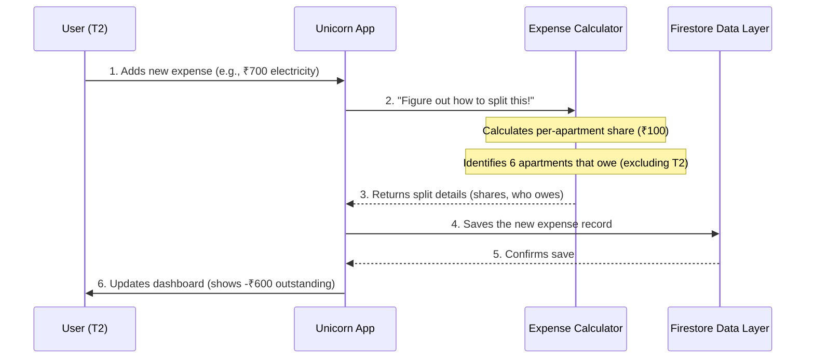

# Chapter 1: Expense Management & Logic

Welcome to the first chapter of our Unicorn Properties development guide! In this chapter, we're going to dive into the core "brain" of our apartment management system: **Expense Management & Logic**.

Imagine living in an apartment complex where everyone shares certain bills, like electricity for common areas or cleaning services. It can be tricky to keep track of who paid what, who owes whom, and how much is still outstanding. This is where our "Expense Management & Logic" system comes in – it's like having a super smart, automatic financial calculator and a very meticulous accountant rolled into one!

## What Problem Does This Solve?

At its heart, this system solves the problem of **fairly splitting shared costs and tracking payments** among all apartments.

Let's use a common example:
**Central Use Case:** Someone from Apartment T2 pays a big electricity bill for the entire complex, say **₹700**. This bill needs to be split equally among the **7 apartments** in the complex. Our system automatically figures out how much each apartment owes and then tracks who has paid their share back to Apartment T2.

By the end of this chapter, you'll understand how our system handles this, from splitting the bill to tracking who owes what!

---

### Key Concepts: The Brain Behind the Bills

Our Expense Management system is built on a few key ideas:

1. **Automatic Bill Splitting:** When a shared bill is added, the system doesn't make you do any math. It instantly divides the total cost equally among all 7 apartments. But here's a smart twist: the apartment that *paid* the bill doesn't owe themselves a share!
    * **Example:** If T2 pays ₹700, and there are 7 apartments, each apartment's share is ₹100 (₹700 / 7). T2 already paid, so they don't owe themselves. The other 6 apartments each owe ₹100. So, a total of ₹600 is outstanding.

2. **Tracking Who Owes What:** The system keeps a clear record of every single payment. It knows exactly which apartments still need to pay their share for each expense. It even shows you a big, clear number on your screen telling you how much money is still owed *to you* (if you paid a bill).

3. **Marking Payments as Complete:** When an apartment pays back its share to the one who originally paid the bill, the system allows you to easily mark that payment as "done." As payments are marked, the outstanding amount automatically goes down.

---

### How to Use the Expense Management System

Let's see how our system handles the example of Apartment T2 paying the ₹700 electricity bill.

#### 1. Adding a New Expense

When Apartment T2 adds the ₹700 electricity bill:

* T2 logs into the system.
* They create a new expense entry, typing in "Electricity Bill" for ₹700.
* They choose "T2" as the apartment that paid.

Behind the scenes, the system immediately calculates:

* **Per Apartment Share:** ₹100 (₹700 / 7 apartments)
* **Owed By:** Apartments T1, T3, T4, T5, T6, T7 (all 6 of them!)
* **Total Outstanding for T2:** ₹600 (6 apartments x ₹100)

Here's a simplified look at how an expense is added, focusing on the data being sent to the system:

```typescript
// From src/app/api/expenses/route.ts (simplified)
// This code receives expense details from the user's browser.
export async function POST(request) {
  const body = await request.json();
  const {
    amount,          // e.g., 700
    description,     // e.g., "Electricity Bill"
    paidByApartment, // e.g., "T2"
    owedByApartments, // e.g., ["T1", "T3", "T4", "T5", "T6", "T7"] (calculated by the app)
    perApartmentShare, // e.g., 100 (calculated by the app)
    categoryId,      // e.g., "electricity"
  } = body;

  // ... (more checks and security) ...

  // System saves this new expense to its memory (data layer).
  const expense = await addExpense({
    amount,
    categoryId,
    description,
    paidByApartment,
    owedByApartments,
    perApartmentShare,
  });
  // Output: The new expense is saved, and T2's dashboard now shows -₹600 outstanding.
  return { status: 'success', expense };
}
```

This piece of code is like the "front door" for new expenses. When you fill out the expense form on the app, this code receives that information and ensures all the necessary details (like who paid and how much each owes) are ready to be saved. The `addExpense` part then saves it into our system's memory.

#### 2. Tracking Outstanding Balances

After T2 adds the expense, the system automatically shows a clear "Total Outstanding Amount" on T2's dashboard.

```typescript
// From src/components/outstanding-balance.tsx (simplified)
// This code displays the total money still owed to the current user.
export function OutstandingBalance({ expenses, currentUserApartment }) {
  if (!currentUserApartment) return null; // Only show if we know who the user is

  // This function adds up all outstanding amounts for expenses paid by the user.
  const totalOutstanding = calculateTotalOutstanding(expenses, currentUserApartment);

  if (totalOutstanding <= 0) return null; // Don't show if nothing is owed

  return (
    // This part shows the red alert card on the dashboard
    <Card className="border-red-200 bg-red-50">
      <p className="font-medium text-red-800">Total Outstanding Amount</p>
      <div className="text-2xl font-bold text-red-700">-₹{totalOutstanding.toFixed(2)}</div>
    </Card>
  );
}
```

This is a small part of the code that's responsible for showing the red "Total Outstanding Amount" box you see on the dashboard. It takes all the expenses and figures out how much is still owed to the current user's apartment. If there's money owed, it proudly displays it in red!

#### 3. Marking Payments

Now, let's say Apartment T1 pays its ₹100 share to T2. T2 can then easily mark T1's payment as complete.

```typescript
// From src/components/expenses/expense-item.tsx (simplified)
// This code handles marking an apartment's payment status for a specific expense.
export function ExpenseItem({ expense, onExpenseUpdate }) {
  // ... (other parts of the expense display) ...

  const handleMarkPaid = async (apartmentId) => {
    // This line updates the expense data in memory, marking the apartment as paid.
    const updatedExpense = markApartmentAsPaid(expense, apartmentId);

    // This line saves the updated expense status to our data layer.
    await updateExpense(expense.id, { paidByApartments: updatedExpense.paidByApartments });

    // Tell the app to refresh with the new data.
    onExpenseUpdate?.(updatedExpense);
    // Output: T1's status changes from 'Pending' to 'Paid',
    // and the overall outstanding amount for T2 decreases by ₹100.
  };

  const handleMarkUnpaid = async (apartmentId) => {
    // This line updates the expense data in memory, marking the apartment as unpaid.
    const updatedExpense = markApartmentAsUnpaid(expense, apartmentId);

    // This line saves the updated expense status to our data layer.
    await updateExpense(expense.id, { paidByApartments: updatedExpense.paidByApartments });

    // Tell the app to refresh with the new data.
    onExpenseUpdate?.(updatedExpense);
    // Output: T1's status changes from 'Paid' to 'Pending',
    // and the overall outstanding amount for T2 increases by ₹100.
  };

  return (
    // This section contains the 'Paid' / 'Unpaid' buttons next to each apartment
    // ... (UI elements for marking payments) ...
  );
}
```

This snippet shows the logic behind those "Mark Paid" and "Mark Unpaid" buttons you see for each apartment. When you click one, it calls a function that updates the expense record in our system's memory and then saves that change. This makes sure the system's "accountant" always has the latest information.

---

### Internal Implementation: What Happens Under the Hood?

Let's peek behind the curtain to understand how these calculations and tracking work.

#### The "Expense" Object

First, it's helpful to know how an "expense" is stored in our system. Think of it as a detailed record with specific labels (like `id`, `amount`, `paidByApartment`).

```typescript
// From src/lib/types.ts (simplified for Expense)
type Expense = {
  id: string; // Unique ID for this expense
  description: string; // What the expense is for (e.g., "Electricity Bill")
  amount: number; // The total original amount (e.g., 700)
  date: string;
  paidByApartment: string; // Which apartment paid it (e.g., "T2")
  owedByApartments: string[]; // Which apartments originally owe money (e.g., ["T1", "T3", ...])
  perApartmentShare: number; // How much each apartment owes (e.g., 100)
  paidByApartments?: string[]; // Which apartments *have paid back* (e.g., ["T1"])
  categoryId: string;
  receipt?: string;
};
```

This is the blueprint for every expense record. Notice `paidByApartments?`: this is a list that grows as apartments pay back their share. This list is super important for tracking!

#### Step-by-Step: Adding an Expense (Simplified)

Here's a simple flow of what happens when Apartment T2 adds that ₹700 electricity bill:



This diagram shows that when you add an expense, the "Unicorn App" asks the "Expense Calculator" to do the heavy lifting of figuring out the shares. Once that's done, it saves all this information into our "Data Storage" (which is powered by a service called [Firestore Data Layer](06_firestore_data_layer_.md)). Finally, your view of the app is updated to show the new outstanding amount.

#### The Math Magicians: `expense-utils.ts`

The core logic for all calculations and updates lives in a file called `src/lib/expense-utils.ts`. Think of this file as the "math department" of our financial calculator.

Here are its key functions:

1. **`calculateExpenseAmounts(expense)`:**
    * **What it does:** This function takes an expense record and figures out how much is *still* outstanding for that particular expense. It also tells you which apartments have paid and which haven't.
    * **Simplified Code Snippet:**

        ```typescript
        // From src/lib/expense-utils.ts
        export function calculateExpenseAmounts(expense) {
          const { amount, owedByApartments = [], paidByApartments = [], perApartmentShare } = expense;

          // Find apartments that have NOT yet paid their share.
          const unpaidApartments = owedByApartments.filter(
            apartmentId => !paidByApartments.includes(apartmentId)
          );

          // Calculate the total amount still owed for this expense.
          const adjustedAmount = unpaidApartments.length * perApartmentShare;

          return {
            originalAmount: amount,
            adjustedAmount, // This is the amount still outstanding for *this* expense
            paidApartments: paidByApartments,
            unpaidApartments,
            perApartmentShare: perApartmentShare,
          };
        }
        ```

        This function is crucial for displaying the correct "Outstanding" amount for each individual expense item. It simply counts how many apartments *haven't* paid and multiplies by the per-apartment share.

2. **`calculateTotalOutstanding(expenses, payingApartmentId)`:**
    * **What it does:** This function looks at *all* the expenses an apartment has paid for and then sums up how much money is still owed *to that apartment* across all those bills. This is what powers the big red alert on your dashboard.
    * **Simplified Code Snippet:**

        ```typescript
        // From src/lib/expense-utils.ts
        export function calculateTotalOutstanding(expenses, payingApartmentId) {
          // Filter for expenses that *this* apartment paid for.
          return expenses
            .filter(expense => expense.paidByApartment === payingApartmentId)
            .reduce((total, expense) => {
              // For each of these expenses, calculate its outstanding amount
              const calculation = calculateExpenseAmounts(expense);
              return total + calculation.totalOutstanding; // Add to the running total
            }, 0); // Start total at 0
        }
        ```

        This function iterates through all expenses where the current user was the one who paid. For each of these, it asks `calculateExpenseAmounts` (our previous function) how much is still owed, and then adds it all up.

3. **`markApartmentAsPaid(expense, apartmentId)`:**
    * **What it does:** This function updates an expense record to include a specific `apartmentId` in its `paidByApartments` list. This is how the system knows that an apartment's share has been paid.
    * **Simplified Code Snippet:**

        ```typescript
        // From src/lib/expense-utils.ts
        export function markApartmentAsPaid(expense, apartmentId) {
          const paidByApartments = expense.paidByApartments || []; // Get current paid list

          // If already paid, do nothing
          if (paidByApartments.includes(apartmentId)) {
            return expense;
          }

          // Return a NEW expense object with the apartment added to the paid list.
          return {
            ...expense, // Copy all existing expense details
            paidByApartments: [...paidByApartments, apartmentId], // Add the new apartment
          };
        }
        ```

        This function is called when you click "Mark Paid." It adds the apartment's ID to the list of apartments that have paid their share for that expense.

4. **`markApartmentAsUnpaid(expense, apartmentId)`:**
    * **What it does:** This function does the opposite of `markApartmentAsPaid`. It removes an `apartmentId` from the `paidByApartments` list, effectively marking it as outstanding again.
    * **Simplified Code Snippet:**

        ```typescript
        // From src/lib/expense-utils.ts
        export function markApartmentAsUnpaid(expense, apartmentId) {
          const paidByApartments = expense.paidByApartments || []; // Get current paid list

          // Return a NEW expense object with the apartment removed from the paid list.
          return {
            ...expense, // Copy all existing expense details
            paidByApartments: paidByApartments.filter(id => id !== apartmentId), // Remove the apartment
          };
        }
        ```

        This function is called when you click "Mark Unpaid," and it removes the apartment's ID from the paid list.

---

### Conclusion

In this chapter, you've learned about the "Expense Management & Logic" system, which acts as the financial calculator and meticulous accountant for Unicorn Properties. We covered:

* The problem it solves: fairly splitting shared costs and tracking payments.
* How it automatically splits bills among 7 apartments, excluding the payer's share.
* How it tracks who owes what and allows you to mark payments.
* The core "Expense" data structure.
* The key functions in `src/lib/expense-utils.ts` that handle all the calculations and updates.

This system is crucial for keeping the financial side of the apartment complex organized and transparent.

Next, you might be wondering, "How does the system know who is T2 or T1? And who is allowed to mark a payment as 'paid'?" That brings us to our next chapter: [User Authentication & Roles](02_user_authentication___roles_.md), where we'll explore how the system identifies users and assigns them different permissions.

---

<sub><sup>Generated by [AI Codebase Knowledge Builder](https://github.com/The-Pocket/Tutorial-Codebase-Knowledge).</sup></sub> <sub><sup>**References**: [[1]](https://github.com/deepak-sekarbabu-coder/unicorn-properties-dev/blob/dc50f4d226016483a40561a6a93675e1d1ecf810/docs/features/EXPENSE_DIVISION_FEATURE.md), [[2]](https://github.com/deepak-sekarbabu-coder/unicorn-properties-dev/blob/dc50f4d226016483a40561a6a93675e1d1ecf810/src/app/api/expenses/route.ts), [[3]](https://github.com/deepak-sekarbabu-coder/unicorn-properties-dev/blob/dc50f4d226016483a40561a6a93675e1d1ecf810/src/components/expenses/expense-item.tsx), [[4]](https://github.com/deepak-sekarbabu-coder/unicorn-properties-dev/blob/dc50f4d226016483a40561a6a93675e1d1ecf810/src/components/outstanding-balance.tsx), [[5]](https://github.com/deepak-sekarbabu-coder/unicorn-properties-dev/blob/dc50f4d226016483a40561a6a93675e1d1ecf810/src/lib/expense-utils.ts)</sup></sub>
