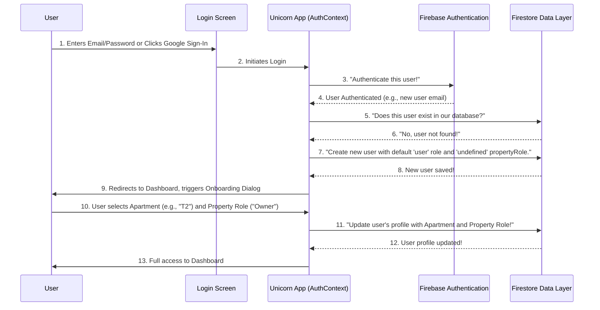

# Chapter 2: User Authentication & Roles

Welcome back to the Unicorn Properties development guide! In our [previous chapter](01_expense_management___logic_.md), we learned how the system acts like a super-smart accountant, helping us track and split shared expenses among apartments.

But as you might have wondered, "How does the system know _who_ is Apartment T2 or T1? And who is even _allowed_ to mark a payment as 'paid'?" That's where **User Authentication & Roles** comes in!

## What Problem Does This Solve?

Imagine our Unicorn Properties application is like an exclusive club. You can't just walk in; you need to be a member and show your ID. And once inside, not everyone has the same access – some are regular guests, while others might be VIPs or even club managers.

This system solves the problem of:

1. **Knowing who you are:** It acts like the bouncer checking your ID at the club entrance. It verifies your identity when you try to log in.
2. **Controlling what you can do:** Once you're "inside" the app, it determines your "role" – like a regular guest or a VIP admin – and limits your actions based on that role.
3. **Welcoming new members:** It ensures that new users set up their profile correctly on their very first visit, like filling out a membership form to choose their "apartment" and "property role".

**Central Use Case:** When someone from Apartment T2 wants to log in to add an electricity bill or mark a payment, how does the system confirm it's really T2? And how does it know T2 is allowed to do these actions, but maybe not manage other users' accounts?

By the end of this chapter, you'll understand how our system handles this, ensuring only the right people get in and do the right things!

---

### Key Concepts: Your Digital Identity and Permissions

Our Authentication & Roles system is built on a few core ideas:

1. **Authentication (The ID Check):**
   - This is the process of verifying who you say you are.
   - When you enter your email and password, or use Google to sign in, the system checks your credentials. If they match, you're "authenticated."
   - **Analogy:** Showing your ID to the bouncer.

2. **Roles (Your Access Pass):**
   - Once you're authenticated, the system knows your "role," which dictates what you can see and do within the application.
   - Unicorn Properties uses **two types of roles** to give us flexibility:

   | Role Type         | What it Defines                                    | Examples                   | Who manages it?                          |
   | :---------------- | :------------------------------------------------- | :------------------------- | :--------------------------------------- |
   | **System Role**   | Your overall access level within the application.  | `user` (default), `admin`  | Usually, `admin` users                   |
   | **Property Role** | Your relationship to an apartment in the property. | `tenant` (renter), `owner` | User during onboarding, or `admin` users |
   - **Analogy:** A "regular guest" (`user`, `tenant`) might only see their own apartment's expenses. A "club manager" (`admin`, `owner`) could see and modify _all_ expenses for all apartments.

3. **Onboarding (The Membership Form):**
   - When you sign up for the very first time, the system needs a bit more information, like which apartment you belong to and whether you're an owner or a tenant.
   - This is a one-time setup process to complete your profile.
   - **Analogy:** Filling out a quick membership form when you join a new club.

---

### How to Use the Authentication System

Let's trace how a user (say, from Apartment T2) logs in and gets access to the system.

#### 1. The Login Screen (`src/app/login/page.tsx`)

This is the first screen you see. It's where you tell the system who you are.

```typescript
// From src/app/login/page.tsx (simplified)
import Image from 'next/image';
import { LoginForm } from '@/components/login-form';

export default function LoginPage() {
  return (
    <div className="flex min-h-screen items-center justify-center">
      <div className="w-full max-w-sm">
        <Image src="/unicorn-logo.png" alt="Logo" width={48} height={48} />
        <h1 className="text-2xl font-semibold">Welcome to Unicorn Properties</h1>
        <p className="text-sm text-muted-foreground">Sign in to your account</p>
        <LoginForm /> {/* This is where you type your email/password or use Google */}
      </div>
    </div>
  );
}
```

This code simply sets up the visual login page. The `LoginForm` component handles the actual input fields and buttons for signing in.

#### 2. The Authentication Brain (`src/context/auth-context.tsx`)

When you click "Sign In," the real magic happens in a central place called `AuthContext`. Think of this as the main control center that listens for your login attempt and manages your user status throughout the app.

```typescript
// From src/context/auth-context.tsx (simplified)
import { onAuthStateChanged } from 'firebase/auth';

// Our database helper
import { auth } from '@/lib/firebase';
import { addUser, getUserByEmail } from '@/lib/firestore';
// Our authentication service
import { User } from '@/lib/types';

// The structure of our user data

export const AuthProvider = ({ children }) => {
  // ... (setup for user state and loading) ...

  React.useEffect(() => {
    const unsubscribe = onAuthStateChanged(auth, async firebaseUser => {
      if (firebaseUser && firebaseUser.email) {
        let appUser = await getUserByEmail(firebaseUser.email); // 🔍 Look up user in our database

        if (!appUser) {
          // If user doesn't exist (first-time login)
          const newUser: Omit<User, 'id'> = {
            name: firebaseUser.displayName || 'New User',
            email: firebaseUser.email,
            role: 'user', // Default: regular user
            propertyRole: undefined, // Needs onboarding!
            apartment: '',
          };
          appUser = await addUser(newUser); // 💾 Create new user in our database
        }
        setUser(appUser); // Store user in our app's memory
        // ... (set session cookie and redirect to dashboard) ...
      } else {
        setUser(null); // User signed out
        // ... (clear session cookie) ...
      }
      // ... (set loading to false) ...
    });
    return unsubscribe;
  }, []); // Run once when the app starts

  // ... (login, logout, and other functions) ...
};
```

This is a core piece of our authentication system. It constantly checks if you're logged in. If you are, it tries to find your user details in our database ([Firestore Data Layer](06_firestore_data_layer_.md)). If it's your very first time, it creates a new basic user record for you, setting your `propertyRole` to `undefined` so we know you still need to complete your profile.

#### 3. New User Onboarding (`src/components/dialogs/select-apartment-dialog.tsx`)

If `AuthContext` sees that your `propertyRole` (and apartment) is `undefined`, it knows you're a new user or haven't finished your profile. It then triggers a special dialog to get this information.

```typescript
// From src/components/dialogs/select-apartment-dialog.tsx (simplified)
import { Dialog, DialogContent, DialogDescription, DialogHeader, DialogTitle } from '@/components/ui/dialog';
import { Button } from '@/components/ui/button';
import { Select } from '@/components/ui/select';
import { RadioGroup, RadioGroupItem } from '@/components/ui/radio-group';

export function SelectApartmentDialog({ open, onOpenChange, user, onSave }) {
  // ... (form setup) ...

  const onSubmit = (data) => {
    // This function is called when you click "Save and Continue"
    onSave(data); // 💾 Saves your chosen apartment and property role
    // Output: The dialog closes, and the user's profile is updated.
    // T2's 'propertyRole' is now 'tenant' and 'apartment' is 'T2'.
  };

  return (
    <Dialog open={open} onOpenChange={onOpenChange}>
      <DialogContent onInteractOutside={e => e.preventDefault()}>
        <DialogHeader>
          <DialogTitle>Welcome, {user.name}!</DialogTitle>
          <DialogDescription>Please complete your profile setup.</DialogDescription>
        </DialogHeader>
        <form onSubmit={form.handleSubmit(onSubmit)} className="space-y-6">
          {/* ... (Apartment Number selection using Select component) ... */}
          {/* ... (Property Role selection using RadioGroup for Owner/Tenant) ... */}
          <Button type="submit">Save and Continue</Button>
        </form>
      </DialogContent>
    </Dialog>
  );
}
```

This component is the "membership form." It asks you to pick your apartment number and whether you are an 'owner' or 'tenant'. Once you fill this out and save, your user profile is complete, and you get full access to the app's features based on your new roles.

#### 4. The Bouncer for Every Page (`src/components/protected-route.tsx`)

To make sure only logged-in users can see sensitive information (like expense details), we have a "bouncer" component called `ProtectedRoute`.

```typescript
// From src/components/protected-route.tsx (simplified)
import { useAuth } from '@/context/auth-context';
import { useEffect } from 'react';
import { useRouter } from 'next/navigation';

export function ProtectedRoute({ children, fallback }) {
  const { user, loading } = useAuth(); // Get user status from AuthContext
  const router = useRouter();

  useEffect(() => {
    if (!loading && !user) {
      console.log('🔒 No authenticated user - redirecting to login');
      router.replace('/login'); // If no user, send them back to login page
    }
  }, [user, loading, router]); // Run this code whenever user or loading status changes

  if (loading) {
    return fallback; // Show a loading screen while checking
  }

  if (!user) {
    return null; // Will redirect, so nothing to show here
  }

  return <>{children}</>; // If user is logged in, show the actual page content
}
```

This component wraps around any page that requires a user to be logged in. It uses `useAuth` to check if there's a user and if the system is still checking. If no user is found after loading, it quickly sends them to the `/login` page. This ensures only authenticated users can access the main parts of the application.

---

### Internal Implementation: What Happens Under the Hood?

Let's peek behind the curtain to understand the flow when a user logs in, especially for the first time.

#### The User Object

Just like we have an `Expense` object blueprint from [Chapter 1](01_expense_management___logic_.md), we also have a blueprint for a `User` in our system:

```typescript
// From src/lib/types.ts (simplified for User)
export type User = {
  id: string; // Unique ID for this user
  name: string; // User's display name
  email?: string; // User's email address
  avatar?: string; // Link to user's profile picture
  role?: 'user' | 'admin'; // System Role (user or admin)
  propertyRole?: 'tenant' | 'owner'; // Property Role (tenant or owner)
  apartment?: string; // Which apartment they belong to (e.g., "T2")
  fcmToken?: string; // For notifications (more in next chapter!)
};
```

Notice `role`, `propertyRole`, and `apartment` here. These are the key pieces of information that determine what a user can do and see.

#### Step-by-Step: User Login & Onboarding Flow

Here's a simple flow of what happens when a new user signs in for the first time:



This diagram illustrates the journey from a new user trying to log in, through getting authenticated by Firebase, having their profile created in our [Firestore Data Layer](06_firestore_data_layer_.md), completing the onboarding, and finally gaining full access to the application.

---

### Conclusion

In this chapter, you've learned about the "User Authentication & Roles" system, which acts as the bouncer and ID checker for Unicorn Properties. We covered:

- The crucial problem it solves: identifying users and controlling their access.
- The difference between **Authentication** (who you are) and **Roles** (what you can do).
- The two types of roles: **System Role** (`user`, `admin`) and **Property Role** (`tenant`, `owner`).
- The **onboarding process** for new users to set up their apartment and property role.
- How core parts of the application like `AuthContext` and `ProtectedRoute` work behind the scenes to manage your identity and access.

This system is fundamental to ensuring the security and proper functioning of the Unicorn Properties application, making sure only authorized users can perform actions like adding expenses or marking payments, as discussed in [Chapter 1: Expense Management & Logic](01_expense_management___logic_.md).

Next, you might wonder, "How does the app tell users when an expense is due or when someone has marked a payment?" That brings us to our next chapter: [Notifications System](03_notifications_system_.md), where we'll explore how the app keeps everyone informed!

---

<sub><sup>Generated by [AI Codebase Knowledge Builder](https://github.com/The-Pocket/Tutorial-Codebase-Knowledge).</sup></sub> <sub><sup>**References**: [[1]](https://github.com/deepak-sekarbabu-coder/unicorn-properties-dev/blob/dc50f4d226016483a40561a6a93675e1d1ecf810/docs/roles/AUTHENTICATION_FLOW.md), [[2]](https://github.com/deepak-sekarbabu-coder/unicorn-properties-dev/blob/dc50f4d226016483a40561a6a93675e1d1ecf810/docs/roles/ROLE_STRUCTURE.md), [[3]](https://github.com/deepak-sekarbabu-coder/unicorn-properties-dev/blob/dc50f4d226016483a40561a6a93675e1d1ecf810/src/app/login/page.tsx), [[4]](https://github.com/deepak-sekarbabu-coder/unicorn-properties-dev/blob/dc50f4d226016483a40561a6a93675e1d1ecf810/src/components/dialogs/select-apartment-dialog.tsx), [[5]](https://github.com/deepak-sekarbabu-coder/unicorn-properties-dev/blob/dc50f4d226016483a40561a6a93675e1d1ecf810/src/components/protected-route.tsx), [[6]](https://github.com/deepak-sekarbabu-coder/unicorn-properties-dev/blob/dc50f4d226016483a40561a6a93675e1d1ecf810/src/context/auth-context.tsx), [[7]](https://github.com/deepak-sekarbabu-coder/unicorn-properties-dev/blob/dc50f4d226016483a40561a6a93675e1d1ecf810/src/lib/auth-utils.ts), [[8]](https://github.com/deepak-sekarbabu-coder/unicorn-properties-dev/blob/dc50f4d226016483a40561a6a93675e1d1ecf810/src/lib/auth.ts)</sup></sub>
