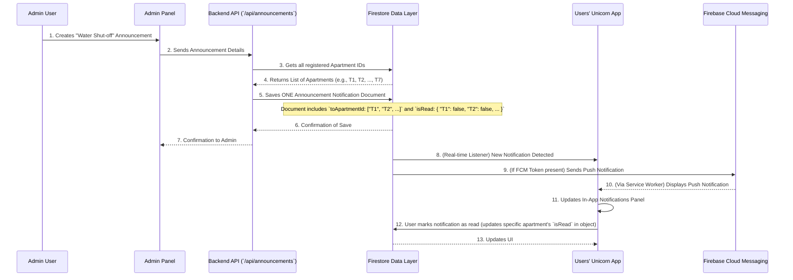

# Chapter 3: Notifications System

Welcome back to the Unicorn Properties development guide! In our [previous chapter](02_user_authentication___roles_.md), we explored how the system knows *who you are* and *what you're allowed to do* through User Authentication & Roles. And before that, in [Chapter 1: Expense Management & Logic](01_expense_management___logic_.md), we learned how the app manages all the shared bills.

But now, imagine this: Apartment T2 just paid a big electricity bill, or maybe an admin has an important update about a building-wide maintenance. How does the app tell *everyone* about these crucial events? How do you get a heads-up even if you're not actively looking at the app?

That's where the **Notifications System** comes in!

## What Problem Does This Solve?

Think of the Notifications System as the **community announcement board** and your **personal messenger service** for the apartment complex. It solves the problem of ensuring everyone stays informed and up-to-date with critical information, whether they are actively using the app or not.

**Central Use Case:** An admin needs to inform all 7 apartments about a planned water shut-off next Tuesday. How does the system make sure this important message reaches everyone, instantly, and even pops up on their phone or computer screen?

By the end of this chapter, you'll understand how our system acts as this vital communication hub!

---

### Key Concepts: The Digital Postman

Our Notifications System is built on a few core ideas:

1. **Real-time Updates:** This means messages arrive almost instantly. You don't have to refresh the app to see new information. It's like getting a text message rather than waiting for a letter in the mail.

2. **Firebase Cloud Messaging (FCM):** This is the "digital postman" or messenger service that delivers our real-time updates. It's a powerful service provided by Google that allows apps to send messages directly to users' web browsers or mobile devices.

3. **Two Types of Notifications:** Our system sends out different kinds of alerts:

    | Notification Type | What it's for                                        | Example                                     | Who sends it?                                 |
    | :---------------- | :--------------------------------------------------- | :------------------------------------------ | :-------------------------------------------- |
    | **Action-Based**  | Alerts for specific events related to your activity. | "T1 paid their ₹100 for Electricity Bill!"  | The system, based on user actions (`Expense Management` logic) |
    | **Announcements** | General messages or important news from management.  | "Water Shut-off Tuesday: 9 AM - 1 PM"       | Admin users only                              |

4. **Read Status:** The system keeps track of which notifications you've seen and read. This helps you quickly spot new messages.

---

### How to Use the Notifications System

Let's see how our system ensures you get important messages, like the water shut-off announcement.

#### 1. Giving Permission for Push Notifications (`src/lib/push-notifications.ts`)

Before our "digital postman" (FCM) can deliver messages to your browser or device, you first need to give the app permission. Think of it like giving the postman your home address. This usually happens the first time you visit the app and allows pop-up notifications even when the app is closed.

```typescript
// From src/lib/push-notifications.ts (simplified)
import { getMessaging, getToken } from 'firebase/messaging';
import * as firestore from './firestore'; // Our database helper

export const requestNotificationPermission = async (userId: string) => {
  // ... (Checks if in browser, checks for VAPID key) ...

  try {
    // 1. Register a special background program (Service Worker)
    const registration = await navigator.serviceWorker.register('/firebase-messaging-sw.js');

    // 2. Ask the user for permission to show notifications
    const permission = await Notification.requestPermission();

    if (permission === 'granted') {
      console.log('Notification permission granted.');

      // 3. Get a unique "token" for this device/browser
      const currentToken = await getToken(getMessaging(), {
        vapidKey: process.env.NEXT_PUBLIC_FIREBASE_VAPID_KEY,
        serviceWorkerRegistration: registration,
      });

      if (currentToken) {
        console.log('FCM Token:', currentToken);
        // 4. Save this token to the user's profile in our database
        await firestore.updateUser(userId, { fcmToken: currentToken });
      }
    } else {
      console.log('Permission denied or not granted.');
    }
  } catch (error) {
    console.error('Error requesting notification permission:', error);
  }
};
```

This code explains the process of asking for notification permission. If you grant it, your browser gives the app a special `fcmToken` (like a unique ID for your device's mailbox). This `fcmToken` is then saved in your user profile in our database, so FCM knows where to send messages to you specifically.

#### 2. Receiving In-App Notifications (`src/components/notifications-panel.tsx`)

Once you're logged in, all your notifications appear in a special panel, usually accessed by clicking a bell icon. This panel constantly listens for new messages related to your apartment.

```typescript
// From src/components/notifications-panel.tsx (simplified)
import { collection, onSnapshot, query, where } from 'firebase/firestore';
import { useAuth } from '@/lib/auth';
import { db } from '@/lib/firebase'; // Our database connection

export function NotificationsPanel() {
  const { user } = useAuth(); // Get current user's apartment

  useEffect(() => {
    if (!user?.apartment) return;

    // Listen for notifications specifically for this apartment
    const unsubscribe = onSnapshot(
      query(collection(db, 'notifications'), where('toApartmentId', 'array-contains', user.apartment)),
      (snapshot) => {
        const notifs = [];
        let unread = 0;
        const now = new Date();

        snapshot.forEach((docData) => {
          const data = docData.data();

          // Filter out expired announcements
          if (data.type === 'announcement' && data.expiresAt && new Date(data.expiresAt) < now) {
            return; // Skip expired
          }

          // Check if this specific user has read the notification
          let isReadForUser = false;
          if (data.type === 'announcement' && typeof data.isRead === 'object') {
            isReadForUser = data.isRead[user.apartment] || false;
          } else {
            isReadForUser = Boolean(data.isRead);
          }

          notifs.push({ ...data, id: docData.id, isRead: isReadForUser });
          if (!isReadForUser) unread++;
        });

        // ... (sort notifications) ...
        // Output: The notification panel updates instantly with new messages.
      }
    );
    return unsubscribe; // Stop listening when component is removed
  }, [user?.apartment]); // Re-run if user's apartment changes

  // ... (rest of the component for displaying notifications) ...
}
```

This code actively "listens" to our database ([Firestore Data Layer](06_firestore_data_layer_.md)) for any new `notifications` that are meant for your apartment. When a new one arrives, it instantly updates the panel, showing you the new message and increasing the unread count. It also smartly filters out any announcements that have already expired.

#### 3. Creating an Admin Announcement (`src/app/api/announcements/route.ts`)

Only `admin` users (as learned in [Chapter 2: User Authentication & Roles](02_user_authentication___roles_.md)) can create general announcements.

```typescript
// From src/app/api/announcements/route.ts (simplified)
import { getFirestore } from 'firebase-admin/firestore';
import { NextResponse } from 'next/server';
import { getFirebaseAdminApp } from '@/lib/firebase-admin';
import { getUserByEmail } from '@/lib/firestore'; // Our database helper

export async function POST(request) {
  // ... (Verify admin user is logged in) ...

  const { title, message, expiresAt, priority = 'medium' } = await request.json();

  const adminDb = getFirestore(getFirebaseAdminApp());

  // Find all apartments to notify
  const usersSnapshot = await adminDb.collection('users').get();
  const apartmentsList = Array.from(new Set(usersSnapshot.docs.map(doc => doc.data().apartment)));

  if (apartmentsList.length === 0) {
    return NextResponse.json({ error: 'No apartments found' }, { status: 400 });
  }

  const notificationData = {
    type: 'announcement',
    title,
    message,
    toApartmentId: apartmentsList, // Send to ALL apartments
    priority,
    isRead: {}, // Start with nobody having read it
    createdAt: new Date().toISOString(),
    expiresAt: expiresAt || null,
  };

  // Initialize 'isRead' for each apartment to false
  apartmentsList.forEach(apartmentId => {
    notificationData.isRead[apartmentId] = false;
  });

  // Save the single announcement to the 'notifications' collection
  const notificationResult = await adminDb.collection('notifications').add(notificationData);

  // Output: A new announcement notification is created, appearing for all users.
  return NextResponse.json({ success: true, notificationId: notificationResult.id });
}
```

This backend code is accessed when an admin creates an announcement. It first makes sure the user is actually an `admin`. Then, it gathers a list of *all* apartments and creates a *single* `announcement` record in our database. This record has a special `toApartmentId` field that is an *array* of all apartment IDs, and an `isRead` field that is an *object* to track who has read it individually.

#### 4. Marking Notifications as Read (`src/components/notification-item.tsx`)

Once you've seen a notification, you can mark it as read, or the system can do it automatically when you view it.

```typescript
// From src/components/notification-item.tsx (simplified)
import { doc, updateDoc } from 'firebase/firestore';
import { db } from '@/lib/firebase';
import type { Notification } from '@/lib/types';
import { useAuth } from '@/lib/auth';

interface NotificationItemProps {
  notification: Notification;
}

export function NotificationItem({ notification }: NotificationItemProps) {
  const { user } = useAuth();

  const handleMarkAsRead = async () => {
    if (!user || !user.apartment) return;

    try {
      if (notification.type === 'announcement' && typeof notification.isRead === 'object') {
        // For announcements, update the specific user's read status in the object
        const updatedIsRead = { ...notification.isRead, [user.apartment]: true };
        await updateDoc(doc(db, 'notifications', notification.id), {
          isRead: updatedIsRead,
        });
      } else {
        // For other notification types, simply set 'isRead' to true
        await updateDoc(doc(db, 'notifications', notification.id), {
          isRead: true,
        });
      }
      // Output: The notification is marked as read, and the unread count decreases.
    } catch (error) {
      console.error('Error marking notification as read:', error);
    }
  };

  return (
    // ... (UI elements like the "Mark as Read" button) ...
    <Button onClick={handleMarkAsRead}>Mark as Read</Button>
  );
}
```

This code snippet shows how a notification is marked as read. If it's a regular notification (meant for one person), its `isRead` status is simply set to `true`. If it's an `announcement` (meant for many), a specific entry for *your* apartment is updated in the `isRead` object, ensuring only *your* read status is changed without affecting others.

---

### Internal Implementation: What Happens Under the Hood?

Let's peek behind the curtain to understand how messages are sent and received.

#### The `Notification` Object

Just like we have blueprints for `Expense` and `User` (from previous chapters), we also have one for a `Notification`:

```typescript
// From src/lib/types.ts (simplified for Notification)
export type Notification = {
  id: string; // Unique ID for this notification
  type: 'reminder' | 'announcement'; // Type of notification
  title: string; // Short summary (e.g., "Electricity Bill Due")
  message: string; // Detailed message
  createdAt: string; // When it was created
  // For action-based notifications:
  toApartmentId?: string; // Which apartment this is for (e.g., "T2")
  amount?: number;
  currency?: string;
  dueDate?: string;
  isRead: boolean | { [apartmentId: string]: boolean }; // Has this specific user read it? (boolean or object for announcements)
  // For announcements:
  toApartmentId?: string[]; // Array of apartment IDs for announcements (e.g., ["T1", "T2", ...])
  createdBy?: string; // User ID of admin who created it
  priority?: 'low' | 'medium' | 'high'; // Importance level
  expiresAt?: string; // When the announcement is no longer relevant
  isActive?: boolean;
};
```

Notice `isRead` can be `boolean` (for single user notifications) or an `object` (for announcements, where each apartment's read status is tracked separately). Also, `toApartmentId` can be a single string or an array of strings, depending on the notification `type`.

#### Step-by-Step: Admin Announcement Flow

Here's a simple flow of what happens when an admin creates a "Water Shut-off" announcement:



This diagram shows how an admin creates an announcement, which is saved as a single document in `FirestoreDB`. The users' apps, which are constantly "listening" to `FirestoreDB` for new notifications (step 8), immediately pick up this change. For users who have given permission, `Firebase Cloud Messaging (FCM)` also sends a push notification directly to their device (steps 9-10), ensuring they see the message even if the app isn't open.

#### The Background Listener: `public/firebase-messaging-sw.js`

For push notifications to work when the app isn't open, a special "Service Worker" file runs in the background. It's like a tiny, invisible helper program in your browser specifically for handling these messages.

```javascript
// From public/firebase-messaging-sw.js (simplified)
// This file must be in the public directory

// Import Firebase libraries for service worker
importScripts('https://www.gstatic.com/firebasejs/8.10.1/firebase-app.js');
importScripts('https://www.gstatic.com/firebasejs/8.10.1/firebase-messaging.js');

// Initialize Firebase with your project's settings
fetch('/firebase-config.json')
  .then(response => response.json())
  .then(firebaseConfig => {
    firebase.initializeApp(firebaseConfig);
    const messaging = firebase.messaging();

    // This function runs when a background message is received
    messaging.onBackgroundMessage(payload => {
      console.log('[firebase-messaging-sw.js] Received background message ', payload);

      const notificationTitle = payload.notification.title;
      const notificationOptions = {
        body: payload.notification.body,
        icon: '/icon-192x192.png', // Icon for the push notification
      };

      // Show the notification to the user
      self.registration.showNotification(notificationTitle, notificationOptions);
    });
  })
  .catch(error => {
    console.error('Failed to load Firebase config:', error);
  });
```

This is the heart of push notifications. This `serviceWorker.js` file, which is registered by the `requestNotificationPermission` function, waits in the background. When FCM sends a message for your device, this service worker "wakes up" and uses `self.registration.showNotification` to display the pop-up notification on your screen, even if your browser tab for Unicorn Properties is closed!

---

### Conclusion

In this chapter, you've learned about the "Notifications System," which acts as the vital communication hub for Unicorn Properties. We covered:

* The problem it solves: keeping everyone informed with real-time updates.
* The role of **Firebase Cloud Messaging (FCM)** as our "digital postman."
* The difference between **Action-Based Notifications** and **Announcements**.
* How the system tracks **Read Status** for notifications.
* The process of granting notification permission and saving your `fcmToken`.
* How users receive notifications in-app via real-time listeners and as pop-up "push" notifications via a `Service Worker`.
* How admins create announcements that reach all apartments through a single database entry.

This system ensures that critical information, whether it's about shared expenses (from [Chapter 1](01_expense_management___logic_.md)) or general announcements, reaches everyone effectively.

Next, you might be thinking, "This app looks nice, but how do they make all these buttons, panels, and dialogs look consistent and easy to use?" That brings us to our next chapter: [UI Component System](04_ui_component_system_.md), where we'll explore how the app builds its visual elements.

---

<sub><sup>Generated by [AI Codebase Knowledge Builder](https://github.com/The-Pocket/Tutorial-Codebase-Knowledge).</sup></sub> <sub><sup>**References**: [[1]](https://github.com/deepak-sekarbabu-coder/unicorn-properties-dev/blob/dc50f4d226016483a40561a6a93675e1d1ecf810/docs/features/ANNOUNCEMENTS_FEATURE.md), [[2]](https://github.com/deepak-sekarbabu-coder/unicorn-properties-dev/blob/dc50f4d226016483a40561a6a93675e1d1ecf810/public/firebase-messaging-sw.js), [[3]](https://github.com/deepak-sekarbabu-coder/unicorn-properties-dev/blob/dc50f4d226016483a40561a6a93675e1d1ecf810/src/app/api/announcements/route.ts), [[4]](https://github.com/deepak-sekarbabu-coder/unicorn-properties-dev/blob/dc50f4d226016483a40561a6a93675e1d1ecf810/src/components/notification-item.tsx), [[5]](https://github.com/deepak-sekarbabu-coder/unicorn-properties-dev/blob/dc50f4d226016483a40561a6a93675e1d1ecf810/src/components/notifications-panel.tsx), [[6]](https://github.com/deepak-sekarbabu-coder/unicorn-properties-dev/blob/dc50f4d226016483a40561a6a93675e1d1ecf810/src/lib/push-notifications.ts)</sup></sub>
