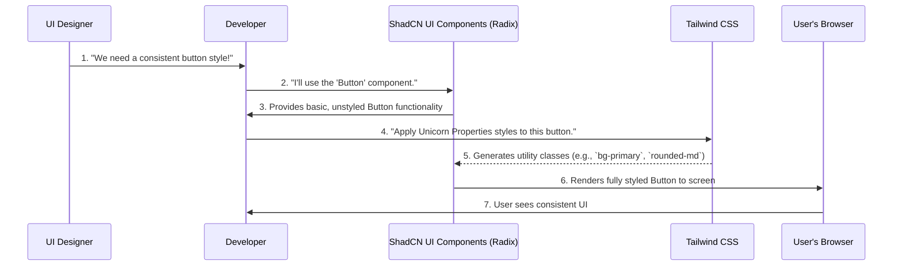

# Chapter 4: UI Component System

Welcome back to the Unicorn Properties development guide! In our [previous chapter](03_notifications_system_.md), we learned how the Notifications System keeps everyone informed with real-time updates and announcements. Before that, we explored User Authentication & Roles in [Chapter 2](02_user_authentication___roles_.md) and the core Expense Management & Logic in [Chapter 1](01_expense_management___logic_.md).

Now, let's switch gears and think about how the Unicorn Properties app _looks_ and _feels_. Have you noticed how all the buttons, forms, and dialog boxes have a similar, clean style? How does the app achieve this consistent, polished appearance without developers having to design every single piece from scratch?

That's where the **UI Component System** comes in!

## What Problem Does This Solve?

Imagine you're building a LEGO castle. Would you carve each brick, window, and door from a block of raw plastic every single time? Of course not! You'd use pre-made, standardized LEGO pieces that fit together perfectly.

Our UI Component System solves a similar problem for building the app's interface (User Interface, or UI). Instead of "carving" every button, input field, or dialog box from scratch, developers use pre-built, standardized pieces called **UI Components**.

This ensures the app:

1. **Looks Consistent:** Every button, every input field, and every popup dialog looks and behaves the same way across the entire application. No messy, mismatched parts!
2. **Is Fast to Build:** Developers can quickly "snap" components together, saving a lot of time and effort compared to building everything from zero.
3. **Is Easy to Use:** Users get a familiar experience because interactive elements work predictably.
4. **Is Easy to Maintain:** If we want to change the color of all buttons, we just change it in one place (the Button component's definition), and it updates everywhere!

**Central Use Case:** Remember the "Add New Expense" dialog from [Chapter 1](01_expense_management___logic_.md) and how clean it looked? How did we create that dialog with its title, description, input fields, dropdown, and buttons so consistently and efficiently? The UI Component System provides the answer.

---

### Key Concepts: The LEGO Set for Your App

Our UI Component System is built on a few core ideas:

1. **What are UI Components?**
   - They are like self-contained, reusable building blocks for your app's visual interface.
   - Each component is responsible for a small, distinct part of the UI, like a `Button`, an `Input` field, or an entire `Dialog` box.
   - They encapsulate both how they look (their styling) and how they behave (their interactivity).

2. **ShadCN UI: Our Pre-built LEGO Bricks**
   - Unicorn Properties uses a set of pre-built components known as **ShadCN UI**.
   - Think of ShadCN UI as a high-quality collection of standard LEGO pieces: buttons, forms, dropdowns, dialogs, and more.
   - These components are built on top of **Radix UI**, which provides the _functionality_ (like making sure a dropdown opens correctly) without any _styling_. This gives us a lot of flexibility!

3. **Tailwind CSS: Painting the LEGO Bricks**
   - **Tailwind CSS** is our styling tool. Instead of writing custom CSS rules, Tailwind provides a huge library of pre-defined "utility classes" that you apply directly to your HTML elements (or components).
   - For example, instead of `background-color: blue; padding: 10px; border-radius: 5px;`, you might write `<button class="bg-blue-500 p-2 rounded-md">`.
   - This is how we "paint" our ShadCN UI components and make them match Unicorn Properties' specific look and feel.

---

### How to Use the UI Component System

Let's look at the "Add New Expense" dialog again (from `src/components/dialogs/add-expense-dialog.tsx`) to see how these UI components are used together.

Instead of writing all the HTML and CSS for a dialog from scratch, we import and use pre-made components like `Dialog`, `Input`, `Select`, and `Button`.

Here's a simplified look at how the `AddExpenseDialog` component uses these building blocks:

```typescript
// From src/components/dialogs/add-expense-dialog.tsx (simplified - showing only UI part)
import { Button } from '@/components/ui/button';
import { Dialog, DialogContent, DialogDescription, DialogFooter, DialogHeader, DialogTitle, DialogTrigger } from '@/components/ui/dialog';
import { Form, FormControl, FormField, FormItem, FormLabel, FormMessage } from '@/components/ui/form';
import { Input } from '@/components/ui/input';
import { Select, SelectContent, SelectItem, SelectTrigger, SelectValue } from '@/components/ui/select';

export function AddExpenseDialog({ children, categories, onAddExpense, currentUser }) {
  // ... (form logic and state management are here) ...

  return (
    <Dialog open={open} onOpenChange={setOpen}>
      <DialogTrigger asChild>{children}</DialogTrigger>
      <DialogContent className="sm:max-w-[425px]">
        <DialogHeader>
          <DialogTitle>Add New Expense</DialogTitle>
          <DialogDescription>Add a new shared expense...</DialogDescription>
        </DialogHeader>
        <Form {...form}>
          <form onSubmit={form.handleSubmit(onSubmit)} className="space-y-4">
            <FormField /* ... for Description */ />
            <Input placeholder="e.g., Monthly electricity bill" {...field} />
            <FormField /* ... for Amount */ />
            <Input type="number" step="0.01" placeholder="120.50" {...field} />
            <FormField /* ... for Category */ />
            <Select /* ... category dropdown options ... */ />
            <Input type="file" accept="image/*" {...fileRef} />
            <DialogFooter className="flex flex-col gap-2">
              <Button type="submit" className="w-full">Add Expense</Button>
              <Button type="button" variant="destructive" className="w-full">Cancel</Button>
            </DialogFooter>
          </form>
        </Form>
      </DialogContent>
    </Dialog>
  );
}
```

In this simplified code, notice how the `AddExpenseDialog` is _composed_ of many smaller UI components.

- `Dialog` is the main popup container.
- `DialogTrigger` is the button that _opens_ the dialog.
- Inside `DialogContent`, we have a `Form` (which itself uses `FormField`, `FormLabel`, `Input`, `Select`, etc.).
- `Button` components are used for "Add Expense" and "Cancel."

By combining these pre-made components, the developer can build a complex UI like the "Add Expense" dialog very quickly, knowing that each piece already looks and functions correctly according to the app's design guidelines.

**Output:** When a user clicks the `DialogTrigger` (e.g., an "Add Expense" button on the dashboard), a beautifully styled pop-up dialog appears, allowing them to fill in the expense details. The input fields will have consistent borders, the dropdown will look just like other dropdowns in the app, and the buttons will match the app's primary and destructive styles.

---

### Internal Implementation: What Happens Under the Hood?

Let's peek behind the curtain to understand how these UI components are built and how they get their consistent look.

#### High-Level Flow: From Design to Display



This diagram illustrates that developers don't start from scratch. They pick a component from ShadCN UI (which gets its core functionality from Radix UI), then apply styling using Tailwind CSS, resulting in a ready-to-use, beautiful component in the user's browser.

#### The Building Blocks: `src/components/ui/`

The `src/components/ui/` folder is where you'll find the core UI components that make up the ShadCN UI library in our project. Each file in this folder typically defines a single UI component like a `Button`, `Input`, or `Dialog`.

Let's look at a super simplified example of how a `Button` is defined:

```typescript
// From src/components/ui/button.tsx (simplified)
import { cn } from '@/lib/utils'; // A helper to combine CSS classes
import * as React from 'react';

const Button = React.forwardRef<HTMLButtonElement, ButtonProps>(
  ({ className, variant, size, asChild = false, ...props }, ref) => {
    // 'cn' combines default button styles with any custom styles
    return (
      <button
        className={cn(
          "inline-flex items-center justify-center rounded-md text-sm font-medium", // Base styles
          "transition-colors focus-visible:outline-none focus-visible:ring-2",
          // 'variant' applies different styles (e.g., primary, destructive)
          variant === "destructive" && "bg-destructive text-destructive-foreground",
          variant === "primary" && "bg-primary text-primary-foreground",
          className // Any extra styles passed in
        )}
        ref={ref}
        {...props}
      />
    );
  }
);
Button.displayName = 'Button';
export { Button };
```

This `Button` component is a great example. It combines a basic HTML `<button>` element with a set of `Tailwind CSS` classes. The `cn` function (which we'll see next) helps combine different class names depending on the `variant` (like `primary` or `destructive`) or any extra `className` provided by the developer using the button. This ensures every button automatically gets the right look.

Similarly, here's a glimpse of the `Input` component:

```typescript
// From src/components/ui/input.tsx (simplified)
import { cn } from '@/lib/utils';
import * as React from 'react';

const Input = React.forwardRef<HTMLInputElement, InputProps>(
  ({ className, type, ...props }, ref) => {
    return (
      <input
        type={type}
        className={cn(
          "flex h-10 w-full rounded-md border border-input bg-background px-3 py-2 text-sm", // Base styles
          "ring-offset-background file:border-0 file:bg-transparent file:text-sm file:font-medium",
          "placeholder:text-muted-foreground focus-visible:outline-none focus-visible:ring-2 focus-visible:ring-ring disabled:cursor-not-allowed disabled:opacity-50",
          className // Any extra styles passed in
        )}
        ref={ref}
        {...props}
      />
    );
  }
);
Input.displayName = 'Input';
export { Input };
```

The `Input` component applies a standard set of styles for its border, background, padding, and focus states. This means every input box in the app will have a consistent look and feel without repetitive styling code.

Even complex components like `Dialog` are built this way:

```typescript
// From src/components/ui/dialog.tsx (simplified - core structure)
'use client';

import * as DialogPrimitive from '@radix-ui/react-dialog'; // Provides core functionality
import { X } from 'lucide-react'; // An icon for closing

import { cn } from '@/lib/utils';
import * as React from 'react';

const Dialog = DialogPrimitive.Root; // The root dialog component

const DialogTrigger = DialogPrimitive.Trigger; // The component that opens the dialog

const DialogContent = React.forwardRef<
  React.ElementRef<typeof DialogPrimitive.Content>,
  React.ComponentPropsWithoutRef<typeof DialogPrimitive.Content>
>(({ className, children, ...props }, ref) => (
  <DialogPrimitive.Portal> {/* Renders dialog outside main flow */}
    <DialogPrimitive.Overlay className="fixed inset-0 z-50 bg-black/80" /> {/* Dim background */}
    <DialogPrimitive.Content
      ref={ref}
      className={cn(
        "fixed left-[50%] top-[50%] z-50 grid w-full max-w-lg translate-x-[-50%] translate-y-[-50%]",
        "border bg-background p-6 shadow-lg duration-200", // Core styling
        className // Any extra styles passed in
      )}
      {...props}
    >
      {children}
      <DialogPrimitive.Close className="absolute right-4 top-4 opacity-70">
        <X className="h-4 w-4" /> {/* Close icon */}
        <span className="sr-only">Close</span>
      </DialogPrimitive.Close>
    </DialogPrimitive.Content>
  </DialogPrimitive.Portal>
));
DialogContent.displayName = DialogPrimitive.Content.displayName;

// ... (other dialog sub-components like Header, Footer, Title, Description) ...

export { Dialog, DialogTrigger, DialogContent };
```

Here you can see `DialogContent` wrapping its functional parts from `DialogPrimitive` (from Radix UI) with Tailwind CSS classes to give it its fixed position, background, padding, and shadow.

#### The Styling Engine: Tailwind CSS Configuration

The actual "paint colors" and spacing rules for Tailwind CSS are defined in `tailwind.config.ts` and `src/app/globals.css`.

```typescript
// From tailwind.config.ts (simplified for colors)
import type { Config } from 'tailwindcss';

export default {
  // ... (content paths and dark mode settings) ...
  theme: {
    extend: {
      colors: {
        background: 'hsl(var(--background))',
        foreground: 'hsl(var(--foreground))',
        primary: {
          DEFAULT: 'hsl(var(--primary))',
          foreground: 'hsl(var(--primary-foreground))',
        },
        secondary: {
          DEFAULT: 'hsl(var(--secondary))',
          foreground: 'hsl(var(--secondary-foreground))',
        },
        destructive: {
          DEFAULT: 'hsl(var(--destructive))',
          foreground: 'hsl(var(--destructive-foreground))',
        },
        border: 'hsl(var(--border))',
        // ... (other colors) ...
      },
      borderRadius: {
        lg: 'var(--radius)', // Uses a CSS variable for consistent rounding
        // ... (md, sm) ...
      },
      // ... (keyframes, animation) ...
    },
  },
  plugins: [require('tailwindcss-animate')],
} satisfies Config;
```

This `tailwind.config.ts` file maps simple names like `primary` and `destructive` to specific color values. Notice that these values are actually `hsl(var(--color-name))`. This means they get their final color from CSS variables defined in our global CSS file.

```css
/* From src/app/globals.css (simplified for colors) */
@tailwind base;
@tailwind components;
@tailwind utilities;

@layer base {
  :root {
    /* These are CSS variables for light mode */
    --background: 0 0% 96%;
    --foreground: 222.2 84% 4.9%;
    --primary: 202 70% 40%; /* Unicorn Properties Blue! */
    --primary-foreground: 210 40% 98%;
    --secondary: 210 40% 96.1%;
    --secondary-foreground: 222.2 47.4% 11.2%;
    --destructive: 0 84.2% 60.2%; /* Red for destructive actions */
    --destructive-foreground: 210 40% 98%;
    --border: 214.3 31.8% 91.4%;
    --radius: 0.5rem; /* The default rounded corner size */
  }
  .dark {
    /* These are CSS variables for dark mode */
    --background: 222.2 84% 4.9%;
    --foreground: 210 40% 98%;
    --primary: 202 70% 60%;
    --destructive: 0 62.8% 30.6%;
    /* ... (dark mode colors) ... */
  }
}

@layer base {
  * {
    @apply border-border; /* Apply a default border color to all elements */
  }
  body {
    @apply bg-background text-foreground; /* Set global background and text colors */
  }
}
```

This `globals.css` file defines the actual color values (using HSL for hue, saturation, lightness) for light and dark modes. When you use `bg-primary` in Tailwind, it uses the `--primary` CSS variable, which is defined here as `202 70% 40%` (a shade of blue). This centralized approach makes it incredibly easy to change the app's entire color scheme by just adjusting these few lines!

#### The Class Combiner: `src/lib/utils.ts`

Many UI components use a small helper function called `cn` from `src/lib/utils.ts`.

```typescript
// From src/lib/utils.ts (simplified)
import { type ClassValue, clsx } from 'clsx';
import { twMerge } from 'tailwind-merge';

export function cn(...inputs: ClassValue[]) {
  return twMerge(clsx(inputs));
}
```

This `cn` function is a handy tool. It takes multiple class names (like `"bg-blue-500"`, `"p-4"`, and maybe a dynamic class like `isActive ? "font-bold" : ""`) and intelligently combines them. If you accidentally provide conflicting classes (like `"p-4"` and `"p-8"`), `twMerge` makes sure the correct, non-conflicting one is applied, keeping your styles clean and predictable.

#### Other Custom Components

Beyond the basic UI components, the system also allows us to build more specialized components, like:

- `src/components/icons/category-icon.tsx`: A component that can display either a predefined icon (like a lightning bolt for electricity) or even an emoji, always with a consistent circular background.
- `src/components/ui/accordion.tsx`: A component that allows you to show and hide content sections, perfect for organizing information, ensuring the animation and behavior are smooth and consistent every time.
- `src/components/ui/visually-hidden.tsx`: An important component for accessibility. It makes content visible to screen readers (for users with visual impairments) but keeps it hidden from visual users, ensuring the app is usable by everyone.

These components demonstrate how the system can be extended and customized while still leveraging the underlying ShadCN UI and Tailwind CSS framework for consistency.

---

### Conclusion

In this chapter, you've learned about the "UI Component System," which acts as the LEGO set for building the Unicorn Properties application's interface. We covered:

- The problem it solves: ensuring a consistent, fast, and easy-to-build/maintain user interface.
- The role of **UI Components** as reusable building blocks.
- How **ShadCN UI** provides pre-built, functional components (built on **Radix UI**).
- How **Tailwind CSS** is used to style these components, defining the app's visual identity.
- How components like `Button`, `Input`, and `Dialog` are internally structured using utility classes and CSS variables.

This system is essential for delivering a polished, user-friendly experience, making sure that everything from adding an expense (from [Chapter 1](01_expense_management___logic_.md)) to logging in (from [Chapter 2](02_user_authentication___roles_.md)) looks and feels cohesive.

Next, you might be wondering, "How do all these different parts—expenses, users, notifications, and UI—work together seamlessly?" That brings us to our next chapter: [Central Application Orchestration](05_central_application_orchestration_.md), where we'll explore how the entire application is tied together to function as a unified system!

---

<sub><sup>Generated by [AI Codebase Knowledge Builder](https://github.com/The-Pocket/Tutorial-Codebase-Knowledge).</sup></sub> <sub><sup>**References**: [[1]](https://github.com/deepak-sekarbabu-coder/unicorn-properties-dev/blob/dc50f4d226016483a40561a6a93675e1d1ecf810/src/app/globals.css), [[2]](https://github.com/deepak-sekarbabu-coder/unicorn-properties-dev/blob/dc50f4d226016483a40561a6a93675e1d1ecf810/src/components/dialogs/add-expense-dialog.tsx), [[3]](https://github.com/deepak-sekarbabu-coder/unicorn-properties-dev/blob/dc50f4d226016483a40561a6a93675e1d1ecf810/src/components/icons/category-icon.tsx), [[4]](https://github.com/deepak-sekarbabu-coder/unicorn-properties-dev/blob/dc50f4d226016483a40561a6a93675e1d1ecf810/src/components/ui/accordion.tsx), [[5]](https://github.com/deepak-sekarbabu-coder/unicorn-properties-dev/blob/dc50f4d226016483a40561a6a93675e1d1ecf810/src/components/ui/visually-hidden.tsx), [[6]](https://github.com/deepak-sekarbabu-coder/unicorn-properties-dev/blob/dc50f4d226016483a40561a6a93675e1d1ecf810/tailwind.config.ts)</sup></sub>
