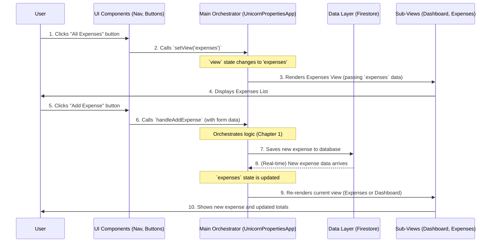

# Chapter 5: Central Application Orchestration

Welcome back to the Unicorn Properties development guide! In our [previous chapter](04_ui_component_system_.md), we learned about the **UI Component System** and how it provides us with reusable "LEGO bricks" to build beautiful and consistent user interfaces. We saw how individual buttons, forms, and dialogs are crafted.

But now, a bigger question arises: How do all these individual pieces – the expense management logic from [Chapter 1](01_expense_management___logic_.md), the user authentication from [Chapter 2](02_user_authentication___roles_.md), the notification system from [Chapter 3](03_notifications_system_.md), and the UI components from [Chapter 4](04_ui_component_system_.md) – come together to form a single, coherent, and functional application? Who is the conductor that makes this entire orchestra play in harmony?

That's where **Central Application Orchestration** comes in!

## What Problem Does This Solve?

Imagine our Unicorn Properties application is a grand orchestra. We have many talented musicians (the different parts of our app, like expense tracking or user login) and beautiful instruments (our UI components). But without a conductor, everyone would play their own tune, and it would be chaos!

Central Application Orchestration is like the **conductor** of our application. It solves the problem of:

1. **Coordinating Everything:** It's the main control panel, ensuring all parts of the app work together smoothly.
2. **Knowing What to Show:** It decides which part of the app (like the Dashboard, Expenses list, or Admin Panel) to display based on what the user is doing.
3. **Managing All the Data:** It pulls together all the different types of information (like details about users, expenses, and categories) and makes sure they are available wherever they're needed.
4. **Handling Global Actions:** It manages big actions that affect multiple parts of the app, such as adding an expense or updating a user's profile.

**Central Use Case:** Let's say a user from Apartment T2 opens the Unicorn Properties app. The system needs to:

- First, confirm it's really them (using [User Authentication & Roles](02_user_authentication___roles_.md)).
- If it's their very first time, prompt them to complete their profile (another part of [User Authentication & Roles](02_user_authentication___roles_.md)).
- Once logged in, it needs to show them their personal **Dashboard**.
- The Dashboard then needs to display _their_ specific outstanding expenses, as well as a list of _all_ users and _all_ expense categories.
- The app must also be ready for them to click "Add Expense" (triggering logic from [Expense Management & Logic](01_expense_management___logic_.md)) or change to a different view like "All Expenses".

By the end of this chapter, you'll understand how our system orchestrates all these pieces to provide a seamless user experience!

---

### Key Concepts: The Conductor's Baton

Our Central Application Orchestration system is built on a few core ideas, mostly centered around a single, powerful component:

1. **The Main Brain (`UnicornPropertiesApp`):**
   - This is the primary component that acts as the "conductor" for almost the entire application's user interface.
   - It lives high up in the component tree, so it can see and control most other parts of the app.

2. **Global State Management:**
   - The "conductor" needs to keep track of the current situation. In our app, this means knowing which "view" (e.g., Dashboard, Expenses) is currently active, and having the most up-to-date lists of `users`, `expenses`, `categories`, and `apartments`.
   - It uses special React features (like `useState` and `useEffect`) to hold and update this information.

3. **Data Flow and Real-time Updates:**
   - The conductor doesn't just _hold_ data; it _gets_ data from our database (which is handled by the [Firestore Data Layer](06_firestore_data_layer_.md)) and then _sends_ that data down to the specific UI components that need to display it.
   - Crucially, it "listens" for real-time changes in the database, so your app updates instantly without you having to refresh the page!

4. **Conditional Rendering (The Scene Director):**
   - Based on user actions or roles, the "conductor" decides which main "scene" or "panel" of the app to show. If you click "Expenses," it shows the expenses list; if you're an admin, it might show the admin panel.

5. **Global Action Handlers (The Master Controls):**
   - When you perform a big action (like adding an expense or updating your profile), the "conductor" has special functions that manage these actions. These functions often combine logic from different parts of the app (like calculating expense splits) and then update the global data, making sure everyone sees the change.

---

### How to Use the Central Application Orchestration

Let's trace how a user from Apartment T2 logs in and navigates the app, seeing how the "conductor" (our orchestration system) manages the experience.

#### 1. Initial Redirection (`src/app/page.tsx`)

When you first open the app, it usually starts at the very root (`/`). This page's job is simple: check if you're logged in and send you to the right place.

```typescript

'use client';

import { useAuth } from '@/context/auth-context';

import { useEffect } from 'react';

// Checks login status
import { useRouter } from 'next/navigation';


export default function Home() {
  const { user, loading } = useAuth(); // Get user and loading status
  const router = useRouter();

  useEffect(() => {
    if (!loading) {
      // Once authentication status is known
      if (user) {
        router.replace('/dashboard'); // Go to dashboard if logged in
      } else {
        router.replace('/login'); // Go to login page if not
      }
    }
  }, [user, loading, router]); // Re-run when user/loading changes

  return null; // Don't show anything on this page directly
}
```

**Explanation:** This code is like the app's front door. It quickly checks your login status using the [Authentication Context](02_user_authentication___roles_.md). If you're signed in, it directs you to the `/dashboard`; otherwise, it sends you to the `/login` page. This is the very first step of orchestration: directing the user to the correct starting point.

#### 2. Loading the Main Application (`src/app/dashboard/page.tsx`)

Once you're authenticated and arrive at the `/dashboard` page, this is where our main "conductor" component gets loaded.

```typescript
// From src/app/dashboard/page.tsx (simplified)
import { cookies } from 'next/headers';
import { getUserByEmail, getCategories } from '@/lib/firestore'; // Helpers to get data
import { UnicornPropertiesApp } from '@/components/unicorn-properties-app'; // Our main conductor!

async function getAuthenticatedUser() {
  const sessionCookie = (await cookies()).get('session')?.value;
  if (!sessionCookie) return null; // No session means no user
  // ... (server-side session verification omitted for brevity) ...
  const user = await getUserByEmail(decodedToken.email || ''); // Get user details
  return user;
}

export default async function DashboardPage() {
  const user = await getAuthenticatedUser(); // Get logged-in user details
  const initialCategories = await getCategories(); // Fetch categories once

  // The central application component is now loaded,
  // receiving some initial data
  return <UnicornPropertiesApp initialCategories={initialCategories} />;
}
```

**Explanation:** This page prepares the stage for the main app. It attempts to verify the user on the server (for extra security and speed) and fetches some initial, global data like expense `categories` from our database. Then, it renders the `UnicornPropertiesApp` component, which will take over as the central orchestrator for the rest of the user's journey.

#### 3. The Central Conductor (`src/components/unicorn-properties-app.tsx`)

This is the heart of the orchestration! The `UnicornPropertiesApp` component manages all the key pieces of information (called "state") and the overall flow.

```typescript
// From src/components/unicorn-properties-app.tsx (simplified - state & data fetching)
'use client';

import { useAuth } from '@/context/auth-context';

// Talk to our database
import * as React from 'react';

// Get current user
import * as firestore from '@/lib/firestore';
import type { Apartment, Category, Expense, User, View } from '@/lib/types';

export function UnicornPropertiesApp({ initialCategories }) {
  const { user, logout, updateUser: updateAuthUser } = useAuth(); // User info and auth actions
  const [view, setView] = React.useState<View>('dashboard'); // Controls which main section is shown
  const [expenses, setExpenses] = React.useState<Expense[]>([]); // List of all expenses
  const [users, setUsers] = React.useState<User[]>([]); // List of all users
  const [apartments, setApartments] = React.useState<Apartment[]>([]); // List of all apartments
  const [categories, setCategories] = React.useState<Category[]>(initialCategories); // Expense categories

  React.useEffect(() => {
    // 🔍 This effect actively listens for real-time data from Firestore
    if (!user) return; // Wait until user is fully loaded

    // Subscribe to real-time updates for expenses, users, and categories
    const unsubscribeExpenses = firestore.subscribeToExpenses(setExpenses, user.apartment);
    const unsubscribeUsers = firestore.subscribeToUsers(setUsers, user.apartment);
    const unsubscribeCategories = firestore.subscribeToCategories(setCategories);
    firestore.getApartments().then(setApartments); // Fetch all apartment details

    return () => {
      // Clean up listeners when the app component is removed
      unsubscribeExpenses();
      unsubscribeUsers();
      unsubscribeCategories();
    };
  }, [user]); // Re-run this setup if the user changes

  // ... (other functions and components defined here) ...
}
```

**Explanation:** This component holds the "master score" for the entire application. It uses `React.useState` to store the current application `view` (e.g., 'dashboard', 'expenses'), and lists of `expenses`, `users`, `categories`, and `apartments`. The `React.useEffect` hook is vital: it establishes real-time connections to our database (the [Firestore Data Layer](06_firestore_data_layer_.md)). This means any change to an expense, a user, or a category in the database is _instantly_ reflected in the app, keeping all the data fresh and accurate!

#### 4. Directing the Scene (Conditional Rendering)

The `UnicornPropertiesApp` decides which main section of the app to display.

```typescript
// From src/components/unicorn-properties-app.tsx (simplified - inside UnicornPropertiesApp)
import { DashboardView } from './dashboard/dashboard-view';
import { ExpensesView } from './expenses/expenses-view';
import { AdminView } from './admin/admin-view'; // Dynamic import for admin view

const MainContent = () => {
  switch (view) { // Based on the 'view' state, show different parts of the app
    case 'admin':
      // Only show AdminView if user has 'admin' role (from Chapter 2)
      if (user?.role !== 'admin') return <DashboardView /* ... */ />;
      return <AdminView users={users} categories={categories} /* ... */ />;
    case 'expenses':
      return <ExpensesView expenses={expenses} categories={categories} /* ... */ />;
    case 'analytics':
      return <AnalyticsView expenses={expenses} categories={categories} /* ... */ />;
    // ... (other cases for community, fault reporting, etc.) ...
    default: // Default view when no other is selected
      return <DashboardView user={user} expenses={expenses} users={users} /* ... */ />;
  }
};

return ( // This is what UnicornPropertiesApp actually renders
  <>
    {/* Provides the sidebar context to all children (from Chapter 4) */}
    <SidebarProvider>
      <Sidebar> {/* The actual sidebar UI */}
        <NavigationMenu
          user={user}
          view={view}
          setView={setView} // Allows navigation to change the 'view'
          role={user?.role || 'user'}
        />
        {/* ... (sidebar footer content) ... */}
      </Sidebar>
      <SidebarInset> {/* The main content area next to the sidebar */}
        <PageHeader
          view={view}
          user={user}
          categories={categories}
          onAddExpense={handleAddExpense} // Pass global action handler
          onUpdateUser={handleUpdateUser}
          onLogout={logout}
        />
        <main className="flex-1 p-3">
          <MainContent /> {/* Renders the selected view (Dashboard, Expenses, etc.) */}
        </main>
      </SidebarInset>
    </SidebarProvider>

    {user && (!user.apartment || !user.propertyRole) && (
      <SelectApartmentDialog // Show onboarding dialog if profile incomplete (from Chapter 2)
        open={true}
        onSave={(data) => {
          const updatedUser = { ...user, apartment: data.apartment, propertyRole: data.propertyRole };
          handleUpdateUser(updatedUser); // Update user profile globally
        }}
        user={user}
      />
    )}
  </>
);
```

**Explanation:** This section of code is the "master switchboard." The `view` state variable (managed by `setView`) determines which major component (`DashboardView`, `ExpensesView`, `AdminView`, etc.) is currently visible. The `NavigationMenu` (from the sidebar) uses `setView` to allow the user to change views. Also, notice how the initial onboarding dialog ([from Chapter 2](02_user_authentication___roles_.md)) is displayed only if a user hasn't completed their profile, demonstrating how orchestration connects different parts of the app's flow.

#### 5. Handling Global Actions (`handleAddExpense`)

When a user performs an action that impacts multiple parts of the app, the "conductor" handles it.

```typescript
// From src/components/unicorn-properties-app.tsx (simplified - inside UnicornPropertiesApp)
const handleAddExpense = async newExpenseData => {
  if (!user?.apartment) return; // Must have an apartment

  const payingApartmentId = user.apartment;
  const allApartmentIds = apartments.map(apt => apt.id);
  const perApartmentShare = newExpenseData.amount / allApartmentIds.length;
  const owingApartments = allApartmentIds.filter(id => id !== payingApartmentId);

  const expenseToSave = {
    ...newExpenseData,
    paidByApartment: payingApartmentId,
    owedByApartments: owingApartments,
    perApartmentShare,
    paidByApartments: [], // Nobody has paid back yet
  };

  const newExpense = await firestore.addExpense(expenseToSave); // Save to database
  setExpenses(prev => [newExpense, ...prev]); // Update our local list of expenses
  // Output: The new expense appears instantly on the Dashboard and Expenses list,
  // and a success message ("toast") pops up.
};
```

**Explanation:** This `handleAddExpense` function is a great example of a global action handler. When a user adds an expense, this central function in `UnicornPropertiesApp` does a lot: it performs the complex calculations for splitting the bill (logic similar to [Chapter 1](01_expense_management___logic_.md)), saves the new expense to the database via `firestore.addExpense`, and then immediately updates the app's internal `expenses` list using `setExpenses`. Because `setExpenses` updates the app's state, any component that displays expenses (like the dashboard or the full expenses list) instantly refreshes to show the new expense and updated outstanding balances.

---

### Internal Implementation: What Happens Under the Hood?

Let's peek behind the curtain to understand the journey of an action, from user click to updated display.

#### High-Level Flow: User Interaction Orchestration



**Explanation:** This diagram illustrates how the `UnicornPropertiesApp` acts as the central conductor. When you interact with any part of the UI (like clicking a navigation item or submitting a form), that interaction is communicated up to the `UnicornPropertiesApp`. The `UnicornPropertiesApp` then updates its central "state" (like which `view` is active or what the `expenses` list looks like), interacts with the database if needed, and finally tells the relevant sub-views to re-display themselves with the new information. This ensures a consistent and responsive user experience.

#### The Core Orchestrator: `src/components/unicorn-properties-app.tsx`

As seen in the snippets above, the `UnicornPropertiesApp.tsx` file is the central nervous system.

- It uses React Hooks (`useState`, `useEffect`) to manage all the important data and trigger updates.
- It passes data down to its child components (like `PageHeader`, `NavigationMenu`, and the various `Views`) using "props." This is how the shared data (`user`, `expenses`, `categories`) reaches all the parts of the UI that need to display it.
- It defines and implements the core logic for global actions (like `handleAddExpense`, `handleUpdateUser`, `handleDeleteExpense`), ensuring that these actions are processed centrally and update the application's state consistently.

#### Connecting the Parts: `PageHeader` and `NavigationMenu`

Components like `src/components/layout/page-header.tsx` and `src/components/layout/navigation-menu.tsx` play a crucial role in enabling interaction with the central orchestrator:

- **`NavigationMenu`** (the sidebar):

  ```typescript
  // From src/components/layout/navigation-menu.tsx (simplified)
  export function NavigationMenu({ user, view, setView, role }) {
    const handleNavigation = (newView) => {
      setView(newView); // This updates the 'view' state in UnicornPropertiesApp
      // ... (close mobile sidebar) ...
    };
    return (
      // ... (UI for buttons) ...
      <SidebarMenuButton onClick={() => handleNavigation('dashboard')} isActive={view === 'dashboard'}>
        Dashboard
      </SidebarMenuButton>
      // ... (other menu buttons calling handleNavigation) ...
    );
  }
  ```

  **Explanation:** This component receives the `setView` function as a prop from `UnicornPropertiesApp`. When a user clicks a navigation button, it simply calls `setView` with the desired `newView` ('dashboard', 'expenses', etc.). This single function call tells the central orchestrator to change what's being displayed.

- **`PageHeader`** (the top bar):

  ```typescript
  // From src/components/layout/page-header.tsx (simplified)
  import { AddExpenseDialog } from '@/components/dialogs/add-expense-dialog';

  export function PageHeader({ view, user, categories, onAddExpense, onUpdateUser, onLogout }) {
    return (
      <header>
        {/* ... (title display) ... */}
        {user && (
          <AddExpenseDialog categories={categories} onAddExpense={onAddExpense} currentUser={user}>
            <Button>Add Expense</Button>
          </AddExpenseDialog>
        )}
        {/* ... (user profile dropdown, logout) ... */}
      </header>
    );
  }
  ```

  **Explanation:** This component uses the `AddExpenseDialog` (an example of a [UI component](04_ui_component_system_.md)). When the dialog's form is submitted, it calls the `onAddExpense` function, which was passed down from `UnicornPropertiesApp`. This is how actions initiated in smaller UI parts trigger the central orchestration logic.

---

### Conclusion

In this chapter, you've learned about **Central Application Orchestration**, the crucial "conductor" that brings all parts of the Unicorn Properties application together. We covered:

- The core problem it solves: coordinating data, views, and actions across the entire application.
- The role of the `UnicornPropertiesApp` component as the central brain managing global state and actions.
- How data flows into the orchestrator from the database (via real-time listeners) and is then passed down to specific UI components.
- How the orchestrator uses "conditional rendering" to display the correct parts of the application (Dashboard, Expenses, Admin, etc.).
- How global action handlers (like `handleAddExpense`) coordinate complex logic and update the entire application's state.

This system ensures that everything from managing shared expenses ([Chapter 1](01_expense_management___logic_.md)) to user authentication ([Chapter 2](02_user_authentication___roles_.md)) and displaying beautiful UI elements ([Chapter 4](04_ui_component_system_.md)) works together seamlessly as a single, unified experience.

Now that you understand how the application coordinates all its activities, you might be wondering, "Where does all this 'data' actually come from, and where is it stored?" That brings us to our next chapter: [Firestore Data Layer](06_firestore_data_layer_.md), where we'll explore our application's robust and real-time database!

---

<sub><sup>Generated by [AI Codebase Knowledge Builder](https://github.com/The-Pocket/Tutorial-Codebase-Knowledge).</sup></sub> <sub><sup>**References**: [[1]](https://github.com/deepak-sekarbabu-coder/unicorn-properties-dev/blob/dc50f4d226016483a40561a6a93675e1d1ecf810/src/app/dashboard/page.tsx), [[2]](https://github.com/deepak-sekarbabu-coder/unicorn-properties-dev/blob/dc50f4d226016483a40561a6a93675e1d1ecf810/src/app/page.tsx), [[3]](https://github.com/deepak-sekarbabu-coder/unicorn-properties-dev/blob/dc50f4d226016483a40561a6a93675e1d1ecf810/src/components/layout/navigation-menu.tsx), [[4]](https://github.com/deepak-sekarbabu-coder/unicorn-properties-dev/blob/dc50f4d226016483a40561a6a93675e1d1ecf810/src/components/layout/page-header.tsx), [[5]](https://github.com/deepak-sekarbabu-coder/unicorn-properties-dev/blob/dc50f4d226016483a40561a6a93675e1d1ecf810/src/components/ui/sidebar.tsx), [[6]](https://github.com/deepak-sekarbabu-coder/unicorn-properties-dev/blob/dc50f4d226016483a40561a6a93675e1d1ecf810/src/components/unicorn-properties-app.tsx)</sup></sub>
