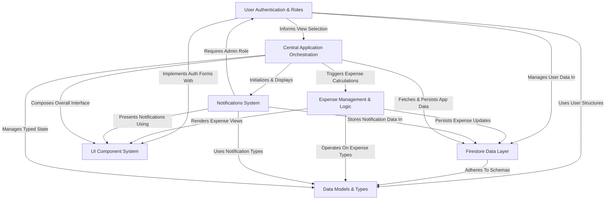

# Tutorial: unicorn-properties-dev

Unicorn Properties Dev is a **web application** designed to simplify _shared living_ in apartment complexes. It helps residents **manage common expenses** by automatically splitting bills, tracks who owes whom, and keeps everyone informed through a real-time _notification system_. Users sign in with specific roles that control their access and features.

## Visual Overview

## Chapters

1. [Expense Management & Logic](01_expense_management___logic_.md)
2. [User Authentication & Roles](02_user_authentication___roles_.md)
3. [Notifications System](03_notifications_system_.md)
4. [UI Component System](04_ui_component_system_.md)
5. [Central Application Orchestration](05_central_application_orchestration_.md)
6. [Firestore Data Layer](06_firestore_data_layer_.md)
7. [Data Models & Types](07_data_models___types_.md)

---

Generated by [AI Codebase Knowledge Builder](https://github.com/The-Pocket/Tutorial-Codebase-Knowledge).
